# 📘 Cahier des Charges  
## Projet : AI Agent – Générateur de CV Personnalisé

---

# 1. Présentation du Projet

## 1.1 Contexte

Le projet consiste à développer une application web intelligente permettant de générer automatiquement des CV personnalisés selon une offre d’emploi donnée.

Aujourd’hui, un même CV générique n’est pas toujours adapté à toutes les offres. Chaque recruteur recherche des compétences, expériences et mots-clés spécifiques. L’objectif de notre application est donc d’aider l’utilisateur à créer un CV adapté à chaque opportunité professionnelle.

L’application permet à l’utilisateur de renseigner son profil, de fournir une offre d’emploi, puis de générer un CV optimisé grâce à un service d’intelligence artificielle.

---

## 1.2 Objectifs du Projet

L’objectif principal est de créer une application web capable de :

- gérer les profils utilisateurs ;
- analyser une offre d’emploi ;
- comparer l’offre avec le profil utilisateur ;
- générer un CV personnalisé ;
- exporter le CV sous format PDF ;
- évoluer d’une architecture monolithique vers une architecture microservices.

---

# 2. Vue Globale du Système

## 2.1 Vue fonctionnelle générale

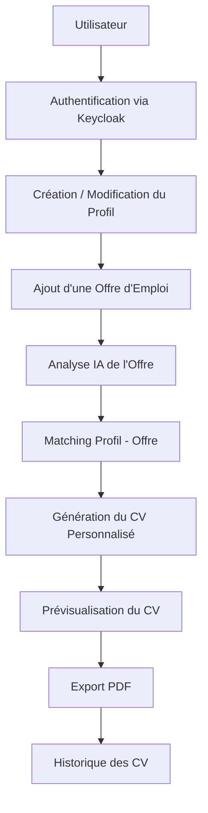

---

## 2.2 Description générale

L’utilisateur commence par se connecter à l’application. L’authentification est gérée par Keycloak, ce qui permet de séparer la gestion de l’identité du reste de l’application.

Après connexion, l’utilisateur peut compléter son profil professionnel : informations personnelles, formations, expériences, compétences, langues et projets.

Ensuite, il saisit ou colle une offre d’emploi. L’application analyse cette offre afin d’identifier les compétences demandées, les responsabilités principales et les mots-clés importants.

Le système compare ensuite le profil de l’utilisateur avec l’offre, puis génère un CV adapté. Ce CV peut être prévisualisé, modifié si nécessaire, puis téléchargé en PDF.

---

# 3. Acteurs du Système

## 3.1 Diagramme des acteurs

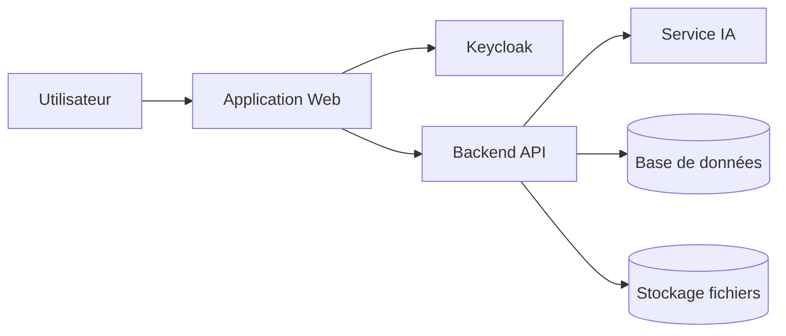

---

## 3.2 Acteurs principaux

| Acteur | Description |
|---|---|
| Utilisateur | Personne qui utilise la plateforme pour générer des CV personnalisés. |
| Keycloak | Service responsable de l’authentification, des rôles et des tokens JWT. |
| Backend API | Partie serveur qui gère la logique métier et orchestre les traitements. |
| Service IA | Service Python chargé de l’analyse et de la génération intelligente du contenu. |
| Base de données | Stocke les profils, offres, CV générés et métadonnées. |
| Stockage fichiers | Stocke les fichiers PDF générés. |

---

# 4. Besoins Fonctionnels

## 4.1 Diagramme de cas d’utilisation

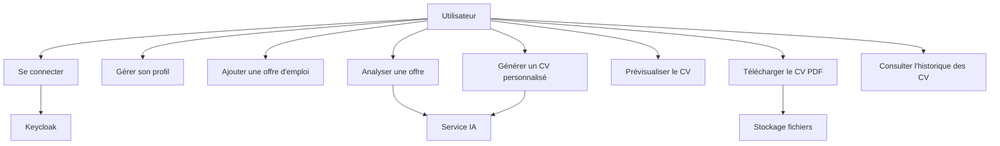

---

## 4.2 Authentification

L’authentification est gérée par Keycloak. Le backend ne stocke pas les mots de passe des utilisateurs. Keycloak fournit un token JWT utilisé pour accéder aux ressources protégées.

### Fonctionnalités liées à l’authentification

- connexion ;
- déconnexion ;
- gestion de session ;
- émission de tokens JWT ;
- gestion des rôles ;
- protection des routes frontend ;
- protection des endpoints backend.

---

## 4.3 Gestion du profil utilisateur

L’utilisateur peut créer et modifier son profil.

Le profil contient :

- nom complet ;
- email ;
- téléphone ;
- adresse ;
- titre professionnel ;
- résumé professionnel ;
- formations ;
- expériences ;
- compétences ;
- projets ;
- langues ;
- certifications.

---

## 4.4 Gestion des offres d’emploi

L’utilisateur peut ajouter une offre d’emploi dans l’application.

Une offre peut contenir :

- titre du poste ;
- nom de l’entreprise ;
- description complète ;
- compétences requises ;
- responsabilités ;
- niveau d’expérience ;
- localisation ;
- type de contrat.

---

## 4.5 Analyse de l’offre d’emploi

Le service IA analyse l’offre pour extraire :

- les compétences techniques ;
- les compétences comportementales ;
- les mots-clés importants ;
- les responsabilités principales ;
- le niveau du poste ;
- les technologies mentionnées ;
- les critères de sélection.

---

## 4.6 Génération du CV personnalisé

Le système utilise le profil utilisateur et l’offre analysée pour générer un CV adapté.

Le CV généré doit :

- mettre en avant les compétences pertinentes ;
- reformuler certaines expériences ;
- adapter le résumé professionnel ;
- intégrer les mots-clés de l’offre ;
- éviter les informations non pertinentes ;
- produire un contenu clair et professionnel.

---

# 5. Besoins Non Fonctionnels

## 5.1 Performance

Le système doit offrir une expérience fluide. Les appels classiques à l’API doivent être rapides. Les traitements IA peuvent prendre plus de temps, mais doivent être gérés correctement pour éviter de bloquer l’application.

| Élément | Objectif |
|---|---|
| Chargement frontend | Rapide et responsive |
| API classique | Moins de 3 secondes |
| Génération IA | Acceptable entre 10 et 40 secondes |
| Téléchargement PDF | Immédiat après génération |

---

## 5.2 Sécurité

Le système doit respecter les bonnes pratiques de sécurité :

- authentification via Keycloak ;
- utilisation de JWT ;
- validation des tokens côté backend ;
- séparation des données utilisateurs ;
- protection des routes ;
- variables sensibles dans `.env` ;
- pas de mots de passe stockés dans l’application principale.

---

## 5.3 Maintenabilité

Le code doit être structuré de manière claire afin de faciliter la transition vers les microservices.

Le backend doit être organisé par modules :

```txt
Auth integration
Profile module
Opportunity module
CV module
AI integration module
File module
```

---

## 5.4 Scalabilité

L’architecture doit permettre une évolution progressive vers les microservices sans reconstruire tout le projet depuis zéro.

---

# 6. Architecture Phase 1 – Monolithe Modulaire

## 6.1 Objectif de la Phase 1

La Phase 1 a pour objectif de livrer rapidement une première version fonctionnelle de l’application.

L’architecture reste simple afin de :

- réduire la complexité ;
- accélérer le développement ;
- faciliter le débogage ;
- valider le besoin métier ;
- préparer la transition vers les microservices.

---

## 6.2 Schéma d’architecture Phase 1

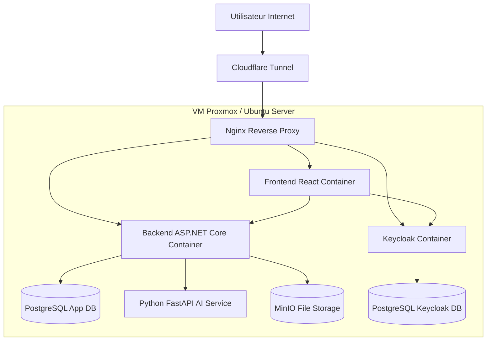

---

## 6.3 Explication de l’architecture Phase 1

Dans la première phase, l’application est déployée dans une machine virtuelle hébergée sur Proxmox. Tous les composants sont lancés sous forme de conteneurs Docker avec Docker Compose.

Le reverse proxy Nginx reçoit les requêtes et les redirige vers les bons services :

- frontend React ;
- backend ASP.NET Core ;
- Keycloak ;
- éventuellement MinIO console si nécessaire.

Cloudflare Tunnel permet d’exposer l’application sur Internet sans ouvrir directement les ports de la machine. Tailscale permet aux membres de l’équipe d’accéder à la VM de manière sécurisée pour l’administration.

---

## 6.4 Flux d’authentification avec Keycloak

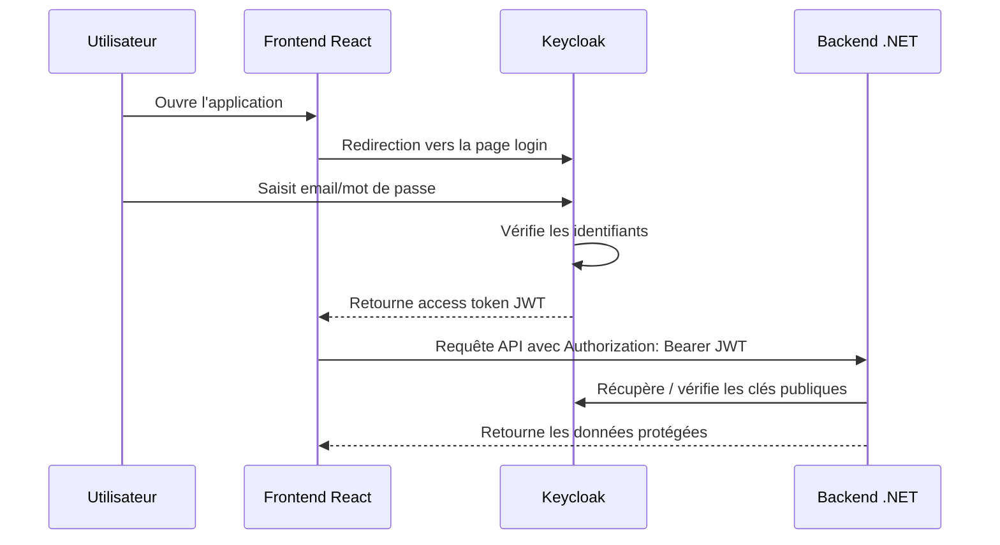

---

## 6.5 Flux de génération de CV en Phase 1

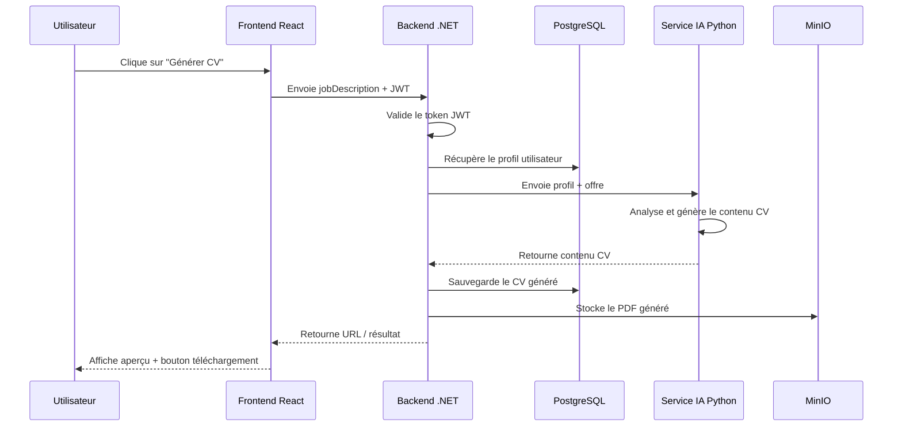

---

## 6.6 Stack technique Phase 1

| Couche | Technologie |
|---|---|
| Frontend | React, Tailwind CSS, React Router |
| Backend | ASP.NET Core Web API |
| IA | Python, FastAPI |
| Authentification | Keycloak |
| Base de données | PostgreSQL |
| Stockage fichiers | MinIO |
| Reverse Proxy | Nginx |
| Conteneurisation | Docker, Docker Compose |
| Infrastructure | Proxmox, Ubuntu Server |
| Accès distant | Tailscale |
| Exposition Internet | Cloudflare Tunnel |

---

# 7. Transition de la Phase 1 vers la Phase 2

## 7.1 Objectif de la transition

La transition consiste à transformer progressivement le backend monolithique en plusieurs services indépendants.

L’objectif n’est pas de tout reconstruire depuis zéro, mais de découper progressivement les responsabilités.

---

## 7.2 Schéma de transition

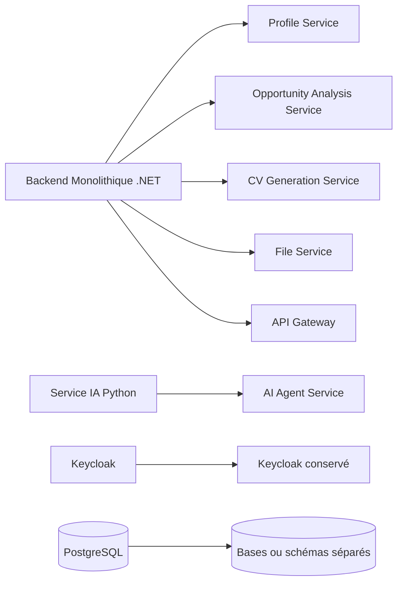

---

## 7.3 Découpage progressif recommandé

Le découpage peut se faire dans cet ordre :

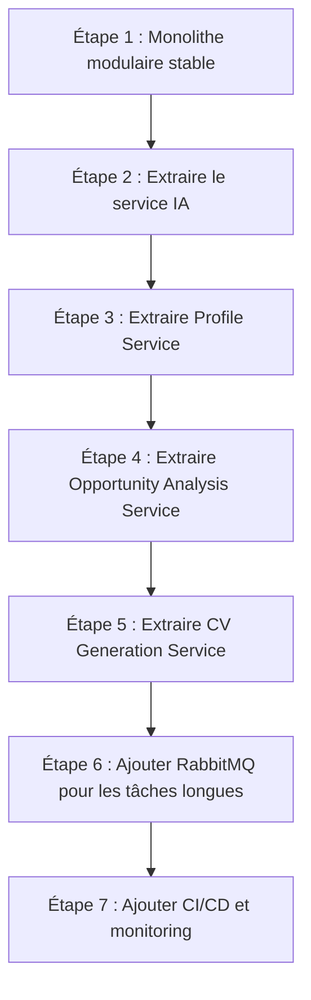

---

# 8. Architecture Phase 2 – Microservices sans Kubernetes

## 8.1 Objectif de la Phase 2

La Phase 2 consiste à passer vers une architecture microservices, mais sans Kubernetes.

Le choix de ne pas utiliser Kubernetes est volontaire. Le projet utilise Docker Compose pour garder une infrastructure compréhensible, stable et adaptée à la taille de l’équipe.

---

## 8.2 Schéma d’architecture Phase 2

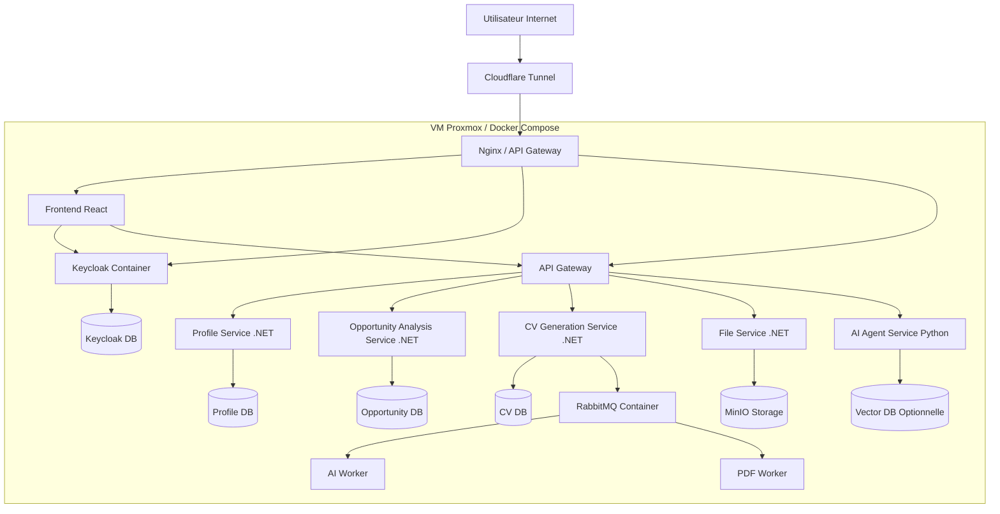

---

## 8.3 Services Phase 2

| Service | Responsabilité | Technologie |
|---|---|---|
| API Gateway | Point d’entrée des APIs | Nginx ou service .NET |
| Profile Service | Gérer les profils utilisateurs | ASP.NET Core |
| Opportunity Analysis Service | Gérer et analyser les offres | ASP.NET Core |
| AI Agent Service | Génération intelligente | Python FastAPI |
| CV Generation Service | Orchestration et génération CV | ASP.NET Core |
| File Service | Gestion des fichiers PDF | ASP.NET Core |
| Keycloak | Authentification et rôles | Keycloak Docker image |
| RabbitMQ | File de messages asynchrones | RabbitMQ |
| MinIO | Stockage des fichiers | MinIO |

---

# 9. Rôle de RabbitMQ

## 9.1 Problème sans RabbitMQ

Sans RabbitMQ, lorsqu’un utilisateur clique sur “Générer CV”, le frontend attend directement la réponse du backend.

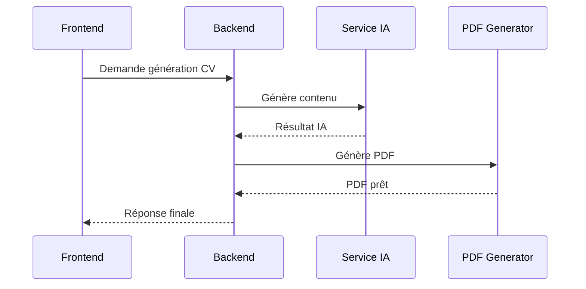

Problème : si l’IA ou le PDF prend du temps, l’utilisateur attend longtemps et la requête peut échouer.

---

## 9.2 Solution avec RabbitMQ

Avec RabbitMQ, le backend ne bloque pas la requête utilisateur. Il crée une tâche en arrière-plan.

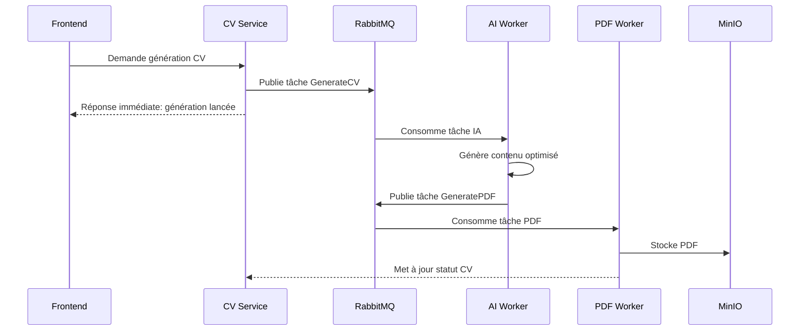

---

## 9.3 Pourquoi RabbitMQ est utile

RabbitMQ permet de :

- traiter les tâches longues en arrière-plan ;
- éviter les timeouts ;
- améliorer l’expérience utilisateur ;
- découpler les services ;
- permettre à plusieurs workers de traiter les tâches ;
- rendre le système plus résilient.

---

# 10. Pourquoi Kubernetes est un Overkill

## 10.1 Schéma comparatif

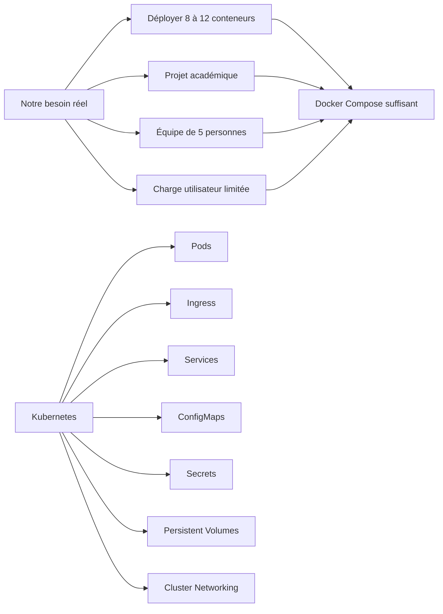

---

## 10.2 Justification

Kubernetes est très puissant, mais il ajoute une complexité importante :

- configuration d’un cluster ;
- gestion des pods ;
- gestion des services internes ;
- Ingress Controller ;
- volumes persistants ;
- secrets ;
- monitoring ;
- débogage plus difficile.

Dans notre projet, Docker Compose répond déjà aux besoins :

- lancer plusieurs conteneurs ;
- créer un réseau interne ;
- gérer les variables d’environnement ;
- exposer certains services ;
- redémarrer automatiquement les conteneurs ;
- faciliter le déploiement.

---

## 10.3 Conclusion sur Kubernetes

Kubernetes est donc considéré comme un overkill pour ce projet car :

- le nombre de services reste limité ;
- la charge utilisateur est faible ;
- l’équipe doit se concentrer sur les fonctionnalités métier ;
- l’infrastructure Proxmox + Docker Compose est déjà suffisante ;
- le coût d’apprentissage est trop élevé par rapport au bénéfice réel.

---

# 11. Modèle de Données

## 11.1 Diagramme de classes

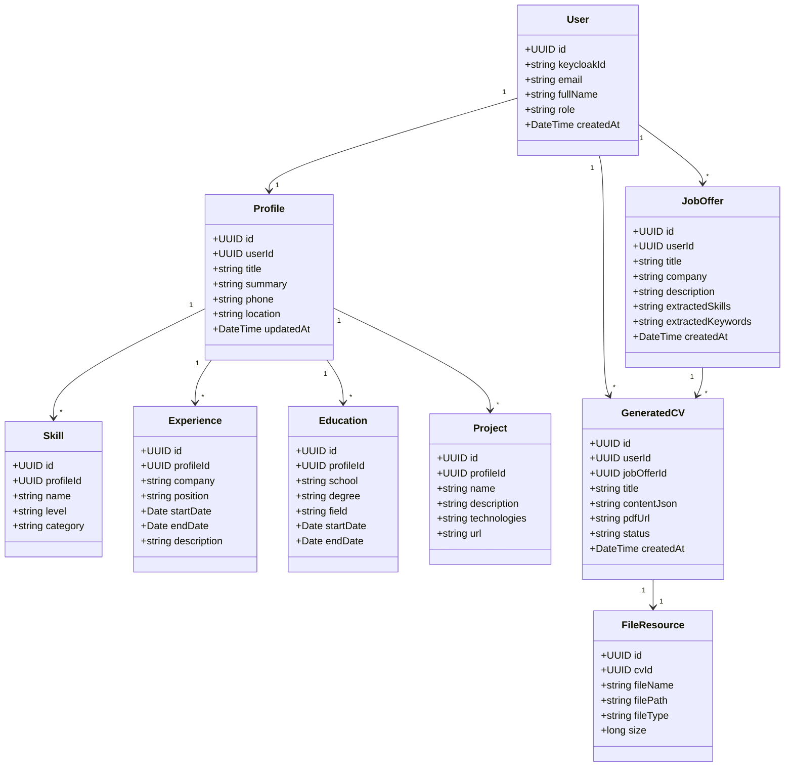

---

## 11.2 Explication du modèle

Le modèle est centré autour de l’utilisateur. Chaque utilisateur possède un profil professionnel. Ce profil contient plusieurs éléments : compétences, expériences, formations et projets.

L’utilisateur peut créer plusieurs offres d’emploi. Chaque offre peut être utilisée pour générer un ou plusieurs CV personnalisés.

Le CV généré est associé à l’utilisateur, à l’offre d’emploi et à un fichier PDF stocké dans MinIO.

---

# 12. Schéma de Base de Données Simplifié

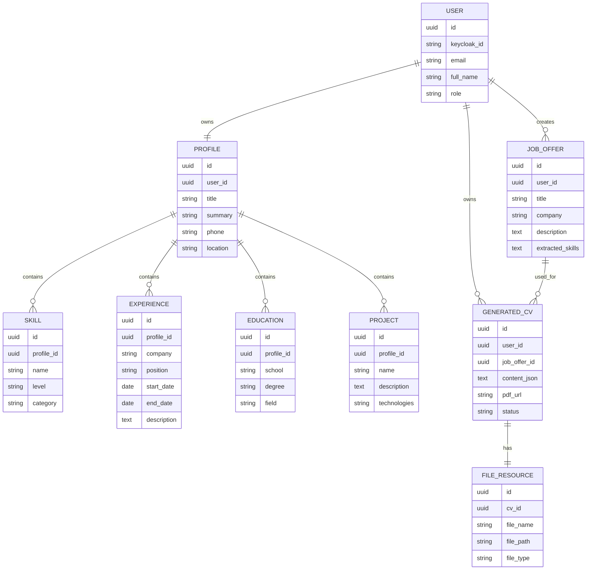

---

# 13. API – Spécification Initiale

## 13.1 Endpoints Profile

| Méthode | Endpoint | Description |
|---|---|---|
| GET | `/api/profile/me` | Récupérer le profil connecté |
| POST | `/api/profile` | Créer un profil |
| PUT | `/api/profile/me` | Modifier le profil |
| DELETE | `/api/profile/me` | Supprimer le profil |

---

## 13.2 Endpoints Job Offer

| Méthode | Endpoint | Description |
|---|---|---|
| POST | `/api/opportunities` | Ajouter une offre |
| GET | `/api/opportunities` | Lister les offres |
| GET | `/api/opportunities/{id}` | Détail d’une offre |
| POST | `/api/opportunities/{id}/analyze` | Analyser une offre |

---

## 13.3 Endpoints CV

| Méthode | Endpoint | Description |
|---|---|---|
| POST | `/api/cvs/generate` | Lancer génération CV |
| GET | `/api/cvs` | Lister les CV |
| GET | `/api/cvs/{id}` | Détail d’un CV |
| GET | `/api/cvs/{id}/download` | Télécharger PDF |
| DELETE | `/api/cvs/{id}` | Supprimer un CV |

---

# 14. Organisation de l’Équipe

## 14.1 Répartition des rôles

| Membre | Rôle principal | Rôle secondaire |
|---|---|---|
| Zakaria | Frontend Lead | Backend |
| Senku | Hosting Infrastructure | QA |
| Assaad | Backend | CI/CD |
| Zentari | Backend | QA |
| Youssef | Hosting Infrastructure | CI/CD |

---

## 14.2 Schéma d’organisation

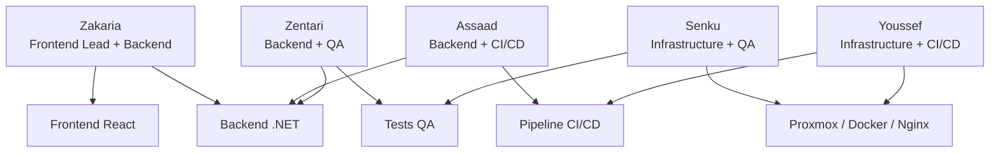

---

# 15. Pipeline CI/CD Prévu

## 15.1 Objectif

Le pipeline CI/CD permet d’automatiser :

- le build du frontend ;
- le build du backend ;
- les tests ;
- la construction des images Docker ;
- le push vers un registry ;
- le déploiement sur la VM.

---

## 15.2 Schéma CI/CD

```mermaid
flowchart LR
    DEV[Développeur Push Code] --> GIT[Git Repository]
    GIT --> CI[CI/CD Pipeline]

    CI --> TEST[Test]
    TEST --> BUILD[Build App]
    BUILD --> IMG[Build Docker Images]
    IMG --> REG[Docker Registry]
    REG --> DEPLOY[Deploy via SSH]
    DEPLOY --> VM[VM Proxmox]
    VM --> DC[Docker Compose Pull + Up]
```

---

# 16. Planning Prévisionnel

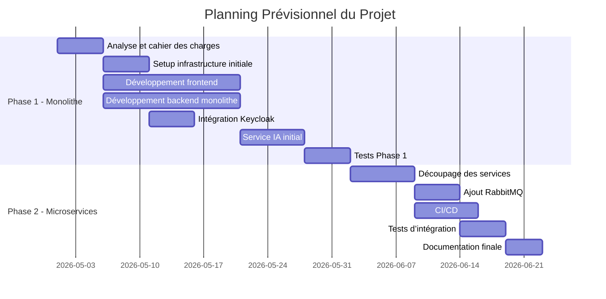

---

# 17. Analyse des Risques

| Risque | Impact | Solution proposée |
|---|---|---|
| Complexité de l’IA | Génération incorrecte | Tester plusieurs prompts et modèles |
| Problèmes d’intégration Keycloak | Blocage auth | Intégrer Keycloak tôt |
| Déploiement difficile | Retard projet | Garder Docker Compose |
| Mauvaise communication équipe | Retard | Répartition claire des rôles |
| Services trop nombreux | Complexité | Découpage progressif |
| Données mal structurées | Bugs backend | Définir modèle DB tôt |

---

# 18. Conclusion

Ce cahier des charges définit les bases fonctionnelles, techniques et organisationnelles du projet AI Agent – Générateur de CV Personnalisé.

Le projet adopte une stratégie progressive :

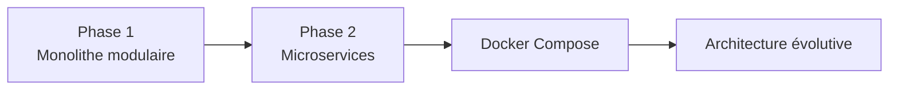

La première phase permet de construire rapidement une application fonctionnelle. La deuxième phase permet d’améliorer l’architecture en séparant les responsabilités sous forme de microservices.

Le choix de ne pas utiliser Kubernetes est justifié par la taille du projet, la taille de l’équipe et les contraintes de temps. Docker Compose reste suffisant pour atteindre les objectifs techniques et pédagogiques du projet.
